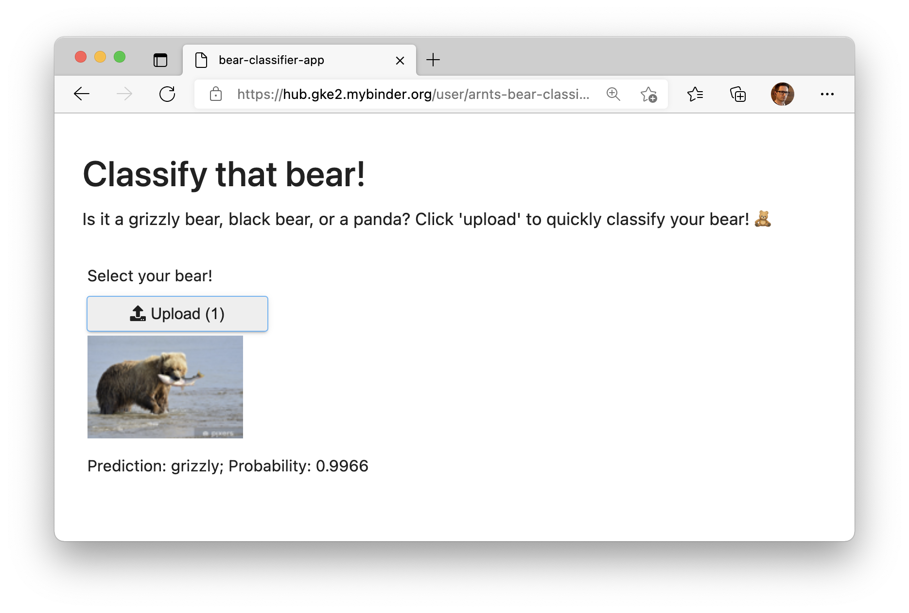

# The amazing bear classifier

## Overview

A super simple project with two notebooks:

1. trains a bear classifier model using fastai
2. enables the classifier as a web app using voila

## Deployment

Feel free to check out the app on binder.

